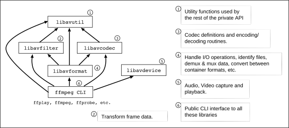

# DRAFT: Writing a codec for `libavcodec`
## Anamitra Ghorui
## *Last updated 25 August 2020*

--------------------------------------------------------------------------------

-   [Foreword](#foreword)
-   [Introduction](#introduction)
-   [The Encoding/Decoding (Transcoding)
    Process](#the-encodingdecoding-transcoding-process)
    -   [Timestamps](#timestamps)
-   [Distinction Between Container Formats and Encoded Audio/Video
    Data](#distinction-between-container-formats-and-encoded-audiovideo-data)

Foreword
--------

This document is more or less a run down of my experience with making a
codec for [FFmpeg](https://ffmpeg.org) with the intent of letting future
developers have a slightly easier time of figuring out where things are.

During my time with FFmpeg, I have only worked with developing a video
codec up till now. Hence, my knowlegde is more or less limited to
libavcodec, libavformat, and libavutil.

If you have any suggestions, please shoot me an email at aghorui (at)
teknik (dot) io or open an issue on
[github](https://github.com/daujerrine/ffmpeg-doc).

This document is under public domain.

Introduction
------------

The FFmpeg suite is a program largely written in C. It's code base is
extremely large consisting of countless codecs, filters, formats,
display/audio facilities, etc.

There are 3 sub-libraries that one is mostly concerned with while
writing a codec:

1.  `libavcodec`, the Encoder/Decoder library,

2.  `libavformat`, the file format and audio/video demuxer library, and

3.  `libavutil`, utility library used by other libraries in the FFmpeg
    suite.

Other libraries that are of lesser concern are:

1.  `libavfilter`, the audio/video data transformation (filtering)
    library. A filter (scale) is needed if you want to convert between
    pixel formats (discussed later)).

2.  `libswscale`, included by the scale filter. Includes pixel format
    conversion routines.

Developing for FFmpeg, or any other library for that matter, requires
one to go through and read a large amount of source code in order to
actually introduce a component or change in it, maybe moreso in FFmpeg.
This document will outline some of the functions that one shall go
through, and explain some things that are not directly mentioned within
inline comments or documentation.

The Encoding/Decoding (Transcoding) Process
-------------------------------------------

The [man page](https://ffmpeg.org/ffmpeg.html#toc-Detailed-description)
of the FFmpeg CLI interface provides a good introduction to how ffmpeg
works.

The FFmpeg CLI performs the following operations in the whole
transcoding process.

` ffmpeg -i in_file out_file `

1.  **libavformat: Probing:** The input file is *probed* to determine
    the file format.

2.  **libavformat: Read Header:** The header is read to get values like
    duration, pixel format, metadata, number of frames, aspect ratio,
    bitrate etc.

3.  **libavformat: Read Packet:**

### Timestamps

Timestamps are simply a numerical quantity that represents time. Used in
the following contexts:

1.  `pts` **- Presentation Timestamp:** Time at which a frame is
    presented to the user.

2.  `dts` **- Decode Timestamp:** Time at which

Distinction Between Container Formats and Encoded Audio/Video Data
------------------------------------------------------------------

> **Note for Developers with a Background in Object Oriented Languages**
>
> C does not have classes and similar provisions in the language,
> however, a very similar method of programming is observable over here
> in the form of *context* structs and functions. Storage structs are
> used to handle repetitive patterns such as for a set of decoder
> functions, parameters etc.
>
> 
